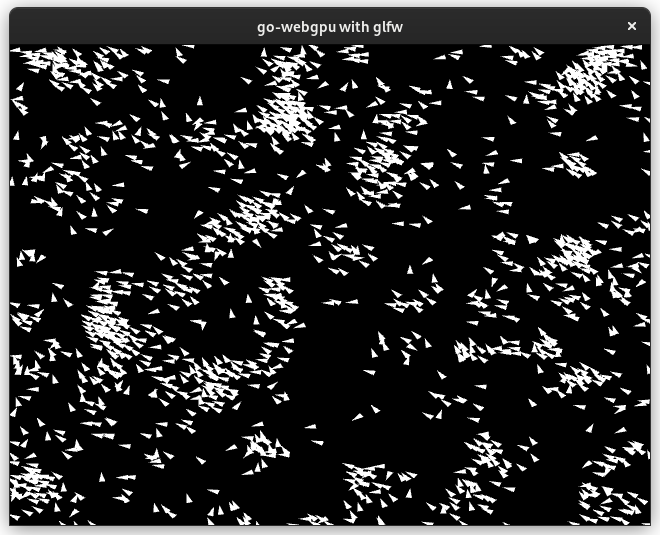
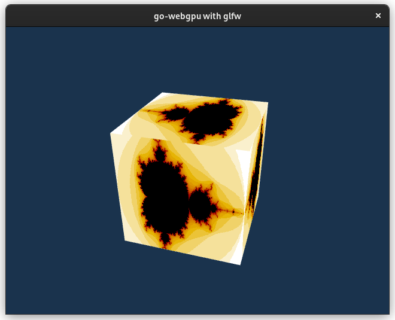
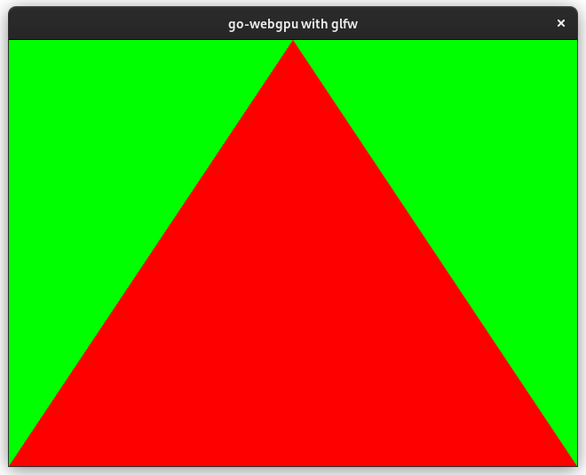

# go-webgpu

Go bindings for [`wgpu-native`](https://github.com/gfx-rs/wgpu-native), a cross-platform, safe, graphics api. It runs natively on Vulkan, Metal, D3D12.

For more info check:
- [WebGPU](https://gpuweb.github.io/gpuweb/)
- [WGSL](https://gpuweb.github.io/gpuweb/wgsl/)
- [webgpu-native](https://github.com/webgpu-native/webgpu-headers)

## cgo

- on windows cgo **is not** used (i.e. works with `CGO_ENABLED=0`). so only Go compiler is needed.

- on unix (linux, darwin, android) cgo **is** used, so you will need C toolchain (`gcc` or `clang`) installed.

Included static libs & windows dll are built via [Github Actions](./.github/workflows/build-wgpu.yml).

## Examples

|                                                    |                                                  |                                                          |
| -------------------------------------------------- | ------------------------------------------------ | -------------------------------------------------------- |
| [][boids-example] | [][cube-example] | [][triangle-example] |

[boids-example]: https://github.com/rajveermalviya/go-webgpu-examples/tree/main/boids
[cube-example]: https://github.com/rajveermalviya/go-webgpu-examples/tree/main/cube
[triangle-example]: https://github.com/rajveermalviya/go-webgpu-examples/tree/main/triangle

You can check out all the examples in [go-webgpu-examples repo](https://github.com/rajveermalviya/go-webgpu-examples)
