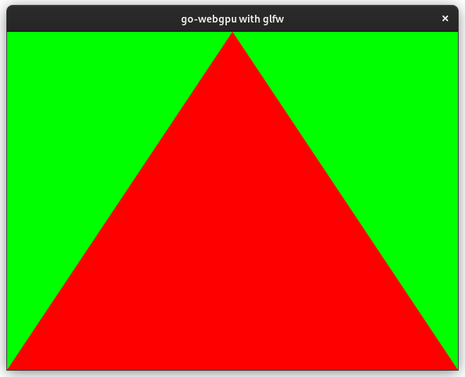
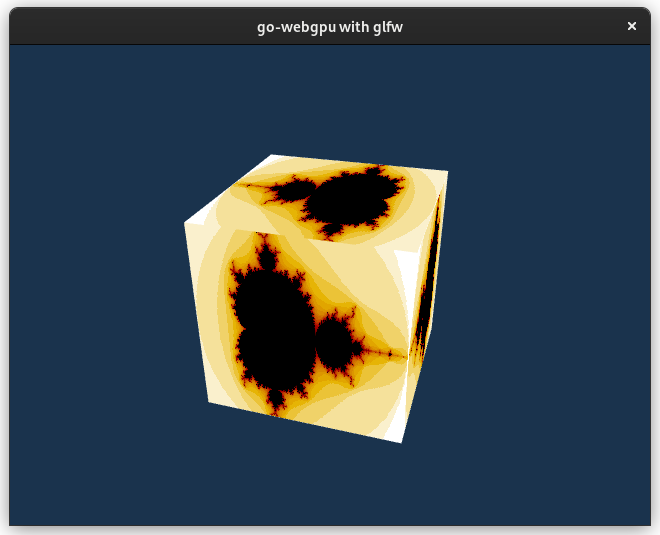
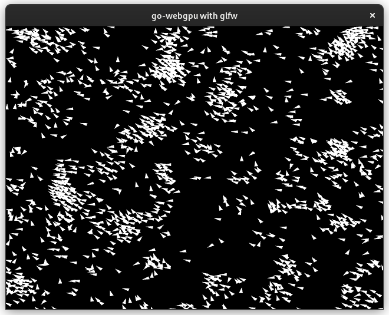

# go-webgpu

Go bindings for [`wgpu-native`](https://github.com/gfx-rs/wgpu-native), a cross-platform, safe, graphics api. It runs natively on Vulkan, Metal, D3D12.

For more info check:
- [WebGPU](https://gpuweb.github.io/gpuweb/)
- [WGSL](https://gpuweb.github.io/gpuweb/wgsl/)
- [webgpu-native](https://github.com/webgpu-native/webgpu-headers)

## cgo

- on windows cgo **is not** used (i.e. works with `CGO_ENABLED=0`). so only Go compiler is needed.

- on unix (linux, darwin, android) cgo **is** used, so you will need C toolchain (`gcc` or `clang`) installed.

Included static libs & windows dll are built via [Github Actions](./.github/workflows/build-wgpu.yml).

## Check out examples

### [compute](./examples/compute/main.go)

```shell
go run github.com/rajveermalviya/go-webgpu/examples/compute@latest
```

### [capture](./examples/capture/main.go)

Creates `./image.png` with all pixels red and size 100x200

```shell
go run github.com/rajveermalviya/go-webgpu/examples/capture@latest
```

### [triangle](./examples/triangle/main.go)

This example uses [go-glfw](https://github.com/go-gl/glfw) so it will use cgo on **_all platforms_**, you will also need
[some libraries installed](https://github.com/go-gl/glfw#installation) to run the example.

```shell
go run github.com/rajveermalviya/go-webgpu/examples/triangle@latest

# same example but with 4x MSAA
go run github.com/rajveermalviya/go-webgpu/examples/triangle-msaa@latest
```



### [cube](./examples/cube/main.go)

This example also uses [go-glfw](https://github.com/go-gl/glfw).

```shell
go run github.com/rajveermalviya/go-webgpu/examples/cube@latest
```



### [boids](./examples/boids/main.go)

This example also uses [go-glfw](https://github.com/go-gl/glfw).

```shell
go run github.com/rajveermalviya/go-webgpu/examples/boids@latest
```



### [gio-windowing](./examples/gio-windowing/main.go)

This example uses [gio](https://gioui.org) toolkit for windowing, it **doesn't** use cgo on windows.

```shell
go run github.com/rajveermalviya/go-webgpu/examples/gio-windowing@latest
```

This example also supports [running on android](https://gioui.org/doc/install/android).

```shell
# install android sdk with ndk bundle
sdkmanager ndk-bundle

# install gogio to build apk
go install gioui.org/cmd/gogio@latest

cd examples/gio-windowing
gogio -arch arm64,arm,amd64 -target android .
adb install gio-windowing.apk
```
